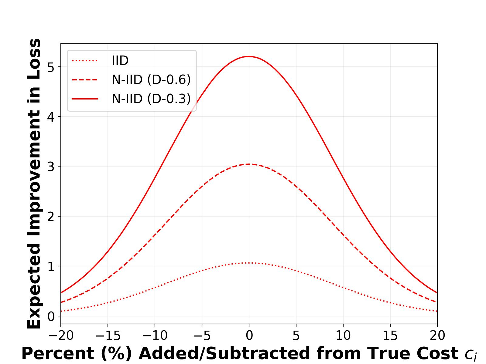
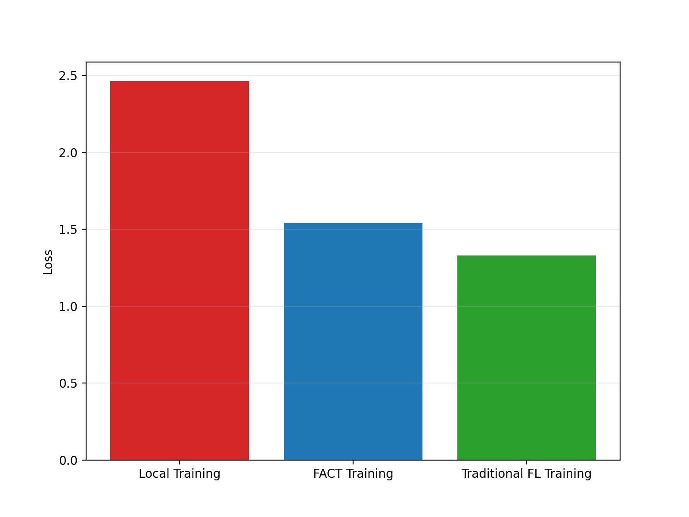
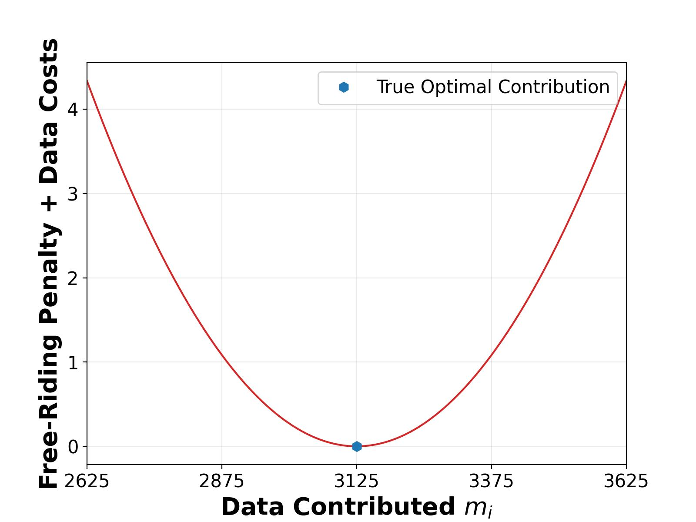

# FACT or Fiction: Can Truthful Mechanisms Eliminate Federated Free Riding?

**Marco Bornstein, Amrit Singh Bedi, Abdirisak Mohamed, Furong Huang** · NeurIPS 2024

[Paper](https://proceedings.neurips.cc/paper_files/paper/2024/hash/803485352e61e3ebf41221e4776c9fd4-Abstract-Conference.html) ·
[arXiv](https://arxiv.org/abs/2405.13879) ·
[OpenReview](https://openreview.net/forum?id=JiRGxrqHh0) ·
[BibTeX](#citation)

Official code for **FACT** (Federated Agent Cost Truthfulness), a federated learning mechanism that

1. **eliminates free riding** with a penalty that moves each agent's best data contribution back to what it would use when training alone,
2. **makes agents truthful** about their costs through a competition: agents are grouped in threes, and an agent whose reported cost lies between the other two wins a reward, and
3. **is individually rational**: participating is never worse than training alone, and better in expectation.

Empirically, FACT prevents free riding when agents can lie about their costs and reduces agent loss by up to 4x compared with local training.

| Truthfulness is optimal (Fig. 1) | FACT beats local training (Fig. 2) | Free riding is penalised (Fig. 3) |
| :---: | :---: | :---: |
|  |  |  |

## How the code maps to the paper

Every agent is one MPI process. A run of [`scripts/train.py`](scripts/train.py) goes through the steps below.

1. Each agent computes its locally optimal contribution m\* = sqrt(γσ²L / 2c) from its marginal cost c (Theorem 1). The agents then split the training set into disjoint shards of those sizes.
2. Each agent **trains locally** on its shard.
3. The agents **train federatedly** from the same initial model, using FedAvg weighted by contribution (Algorithm 1).
4. The agents evaluate the **FACT mechanism**. Each agent's reward is the average improvement of the other agents (Eq. 10), and the sandwich competition is simulated over reported costs c(1 + ε) (Lemma 2).

| Module | Contents |
| --- | --- |
| [`fact/mechanism.py`](fact/mechanism.py) | Optimal contribution, penalty λ and P_fr (Eqs. 4, 21), FACT loss, truthfulness simulation |
| [`fact/comm.py`](fact/comm.py) | Weighted FedAvg over MPI |
| [`fact/engine.py`](fact/engine.py) | Local and federated training loops |
| [`fact/data.py`](fact/data.py) | CIFAR-10, MNIST, HAM10000; iid and Dirichlet non-iid splits |
| [`fact/models.py`](fact/models.py) | ResNet18, the MNIST CNN, pretrained ResNet50 |
| [`fact/config.py`](fact/config.py) | Per-dataset hyperparameters |
| [`scripts/train.py`](scripts/train.py) | Runs one experiment |
| [`scripts/plot.py`](scripts/plot.py) | Regenerates every figure from the logs in `output/` |
| [`scripts/reproduce_paper.sh`](scripts/reproduce_paper.sh) | The command for every committed run |
| [`scripts/prepare_ham10000.py`](scripts/prepare_ham10000.py) | Builds the HAM10000 train/test folders |
| [`output/`](output) | Per-agent logs of every run in the paper |
| [`figures/`](figures) | Figures generated from `output/` |

## Installation

FACT needs Python 3.10+ and an MPI implementation, such as Open MPI (`brew install open-mpi` or `sudo apt install libopenmpi-dev`).

```bash
git clone https://github.com/marcobornstein/FACT.git
cd FACT
pip install -e ".[dev]"        # add ",ham" to prepare HAM10000
```

Tested with Python 3.12, PyTorch 2.4, torchvision 0.19, NumPy 2.0, mpi4py 4.0 and Open MPI 5.

## Quick start

A smoke test on tiny random data with two agents takes a few seconds on a laptop:

```bash
mpirun -n 2 python scripts/train.py --dataset fake --epochs 1 --device cpu
```

Experiments from the paper:

```bash
mpirun -n 16 python scripts/train.py --dataset cifar10 --seed 1
mpirun -n 16 python scripts/train.py --dataset mnist --non-iid 0.3 --seed 4
mpirun -n 10 python scripts/train.py --dataset ham10000 --nonuniform-cost --batch-size 64 --free-riders 4
```

CIFAR-10 and MNIST download to `data/` automatically. HAM10000 has to be downloaded by hand from [Kaggle](https://www.kaggle.com/datasets/kmader/skin-cancer-mnist-ham10000) or [Harvard Dataverse](https://doi.org/10.7910/DVN/DBW86T), then prepared:

```bash
python scripts/prepare_ham10000.py --source ~/Downloads/ham10000 --dest data/HAM10000
```

`--device auto`, the default, uses CUDA, then Apple MPS, then CPU. With several GPUs, agents are assigned to them round-robin. Run `python scripts/train.py --help` to see all options.

Results go to `output/<DATASET>/<name>-<dataset>-<agents>devices/`. An existing folder is never overwritten; a timestamp is appended instead. Each agent `i` writes these files:

| File | Contents |
| --- | --- |
| `r<i>-{local,fed}-epoch-{loss,acc-top1}.log` | Test loss and accuracy after every epoch |
| `r<i>-{local,fed}-train-{loss,acc-top1}.log`, `-{comp,comm}-time.log` | Per-step training statistics |
| `r<i>-marginal-costs.log` | The agent's marginal cost |
| `r<i>-benefits.log` | The agent's improvement over local training, the other agents' average improvement, and its FACT loss |
| `r<i>-expected-epsilon-benefit.npy` | Expected improvement when reporting cost c(1 + ε), for ε in [-0.2, 0.2] |
| `ExpDescription` | The full configuration of the run |

## Reproducing the paper

### Hyperparameters

| Dataset | Model | Optimizer | Learning rate | Batch size | Epochs | Local steps h | Marginal cost | m\* | Agents |
| --- | --- | --- | --- | --- | --- | --- | --- | --- | --- |
| `cifar10` | ResNet18 | SGD (momentum 0.9, weight decay 5e-4, ×0.1 at epochs 50, 75) | 0.05 | 128 | 100 | 6 | 1.024e-07 | 3125 | 16 |
| `mnist` | CNN | Adam | 5e-4 | 128 | 100 | 6 | 7.111e-08 | 3750 | 16 |
| `ham10000` | ResNet50 (ImageNet) | Adam | 1e-3 | 128 | 50 | 6 | 7.79e-07 | 801 | 10 |

Non-iid splits use Dirichlet label skew with α = 0.6 or 0.3 ([Gao et al., 2022](https://arxiv.org/abs/2203.11751)). The sandwich competition is simulated over 100,000 rounds, with opponent costs drawn from N(c, (c/10)²).

### Figures

The logs of every run in the paper are committed in [`output/`](output). Every figure regenerates from them in seconds, with no GPU:

```bash
python scripts/plot.py
python scripts/plot.py --only truthful histogram
```

| Paper | Figure files | Runs in `output/` |
| --- | --- | --- |
| Fig. 1: truthfulness (CIFAR-10, MNIST) | `figures/truthful/` | `CIFAR10/`, `MNIST/`: iid, D-0.6 and D-0.3, three runs each |
| Fig. 2: local vs. FACT vs. FL loss | `figures/histogram/` | same |
| Fig. 3: penalty plus data cost | `figures/free-riding/` | same |
| Fig. 4: HAM10000 case study | `*-ham.jpg` in `histogram/`, `truthful/`, `free-riding/` | `HAM/fact-sandwich-uniform-cost-run{1,2,3}-*` |
| Figs. 5–7: test loss and accuracy | `figures/loss/`, `figures/acc/` | all of the above |
| Robustness to 1, 4 or 8 free riders | `figures/robustness/` | `HAM/fact-robustness-{1,4,8}-*` |

### Rerunning the experiments

[`scripts/reproduce_paper.sh`](scripts/reproduce_paper.sh) lists the exact command and seed of every committed run. It writes to `output-reproduced/` so the committed logs stay untouched:

```bash
bash scripts/reproduce_paper.sh
python scripts/plot.py --results-dir output-reproduced --figures-dir figures-reproduced
```

The test suite checks that each command recreates the configuration recorded in that run's `ExpDescription`. Expect statistical rather than bitwise agreement, since GPU kernels are nondeterministic.

## Tests

```bash
pytest
```

The suite runs in about a minute on a laptop and covers the following:
- **Mechanism.** Optimal contributions match the paper (3,125 / 3,750 / 801), the penalty is minimised at m\* (Theorem 3), and the simulated truthfulness curve matches the closed form 2F(1 − F) (Lemma 2).
- **Data.** Shards are disjoint, deterministic and correctly sized, including when they use the entire dataset, and Dirichlet splits are label-skewed.
- **MPI.** FedAvg and broadcast are checked at 1, 3 and 4 processes. End-to-end training runs with 1, 2 and 3 agents, including free riders with uneven step counts and non-iid data.
- **Provenance.** `scripts/reproduce_paper.sh` is run with a stub `mpirun`. Every command must match its run's recorded configuration, and the non-uniform costs must follow from the seeds.
- **Figures and README.** `scripts/plot.py` regenerates exactly the committed set of figures, and this README's commands and hyperparameter table are checked against the code.

## Citation

```bibtex
@inproceedings{bornstein2024fact,
  title     = {{FACT} or Fiction: Can Truthful Mechanisms Eliminate Federated Free Riding?},
  author    = {Bornstein, Marco and Bedi, Amrit Singh and Mohamed, Abdirisak and Huang, Furong},
  booktitle = {Advances in Neural Information Processing Systems},
  volume    = {37},
  pages     = {69206--69229},
  year      = {2024},
  doi       = {10.52202/079017-2211}
}
```

## Acknowledgments

The HAM10000 preprocessing builds on [temcavanagh/Skin-Cancer-Detection](https://github.com/temcavanagh/Skin-Cancer-Detection). The funding acknowledgments are in the paper.

## License

[MIT](LICENSE)
